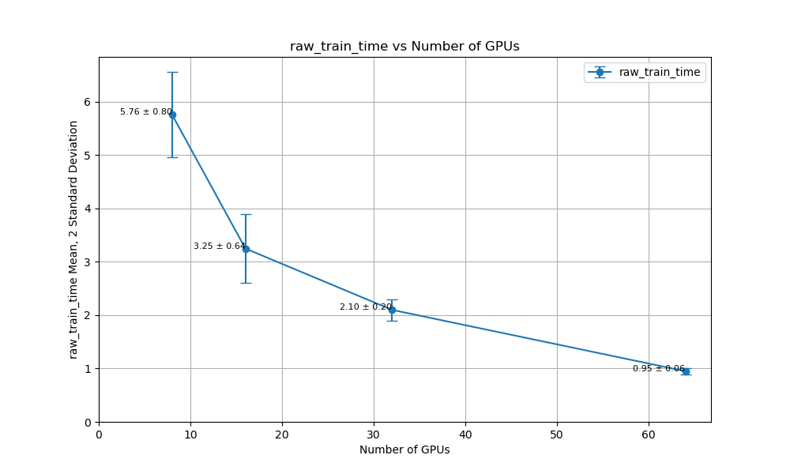
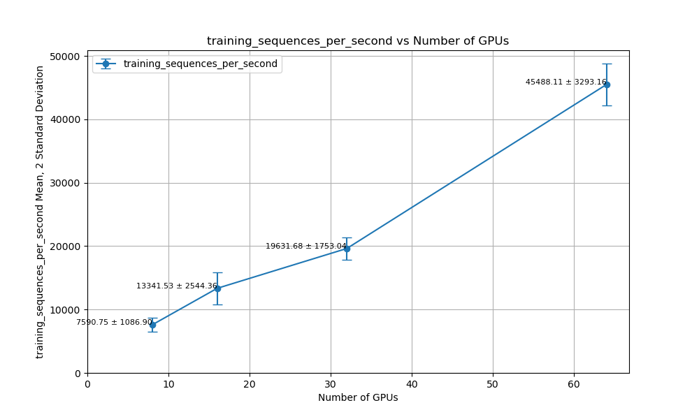
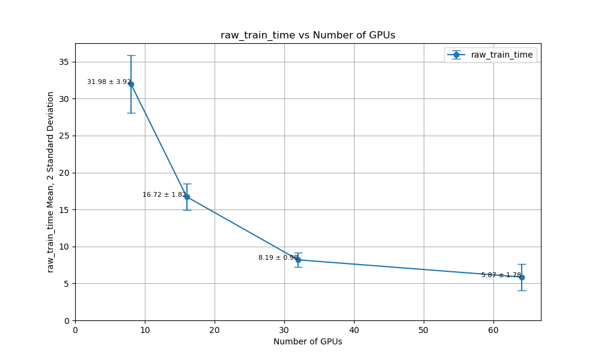
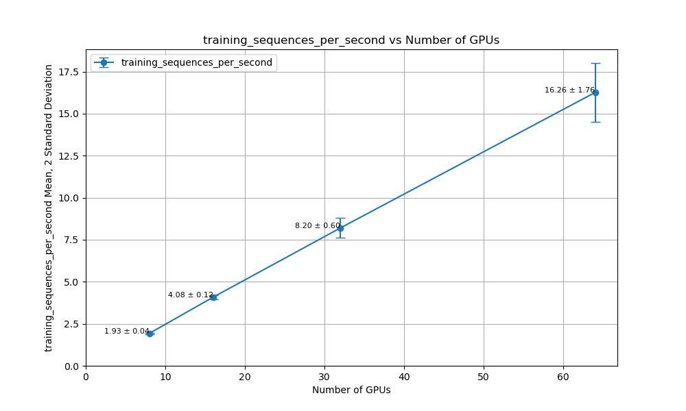
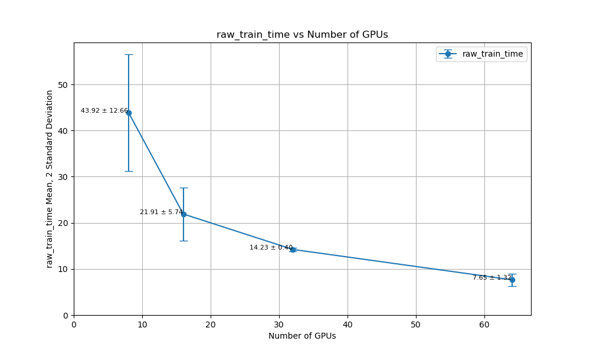
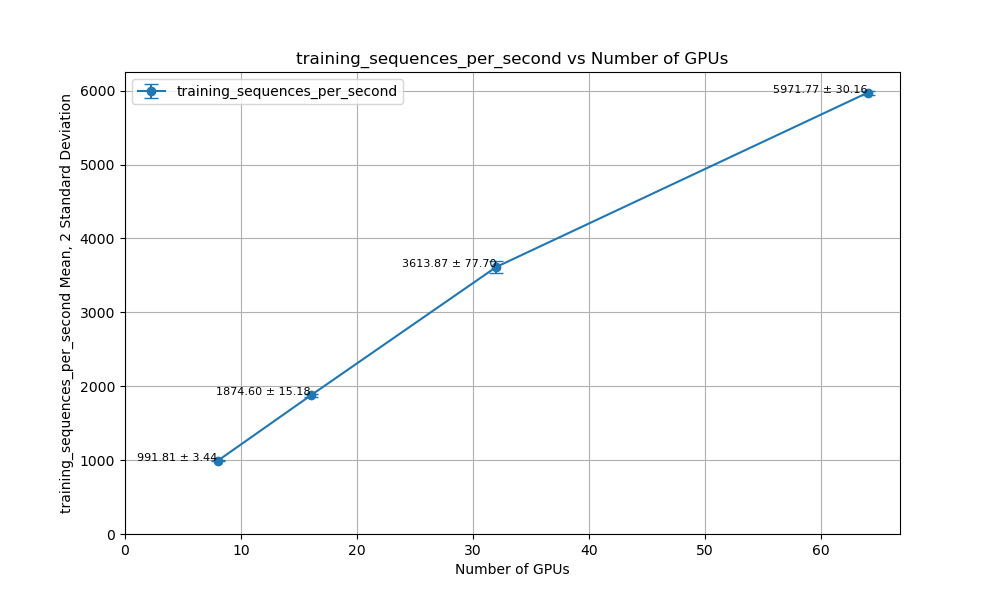

# MLCommons 0.4.1 Benchmarks on Lambda Cloud 1-Click Cluster: Training BERT, Llama2, and Stable Diffusion with 64 GPUs


## TL;DR

* Benchmarked BERT, Llama2 70B LoRA, and Stable Diffusion on a 64xGPU Lambda Cloud [1-Click Cluster](https://lambdalabs.com/service/gpu-cloud/1-click-clusters). Achieving expected MLCommons 0.4.1 model accuracy in just under a minute for BERT, 5 mins for Llama2 70B Lora, and 8 mins for Stable Diffusion.
* Results show a ~6x speedup from 8 to 64 GPUs, with performance differences due to hyper-parameter adaptation and diminishing returns with large batch sizes.
* The benchmarks can be easily reproduced on Lambda Cloud [1-Click Cluster](https://lambdalabs.com/service/gpu-cloud/1-click-clusters), with [step-by-step instructions](./Lambda/benchmarks).

## Lambda Cloud 1-Click Cluster

Our benchmarks are run on a 64-GPU Lambda Cloud [1-Click Cluster](https://lambdalabs.com/service/gpu-cloud/1-click-clusters), featuring three head nodes and eight compute node. Each compute node provides eight NVIDIA H100 80GB SXM5 GPUs, 208 CPU Cores, 1.9 TB RAM, and 24.2 TB SSD, with 3.2 Tb/s inter-node communication using NVIDIA Quantum-2 InfiniBand. A persistent shared storage is attached across all nodes. The setup uses customized images based on NVIDIA’s NGC container, with pre-installed dependencies like NVIDIA drivers, SLURM, Pyxis, and Enroot.

## Results

We benchmarked BERT, Llama2 70B LoRA Fine-Tuning, and Stable Diffusion with configurations ranging from 8 to 64 GPUs. Across all tasks, we observed a ~6x speedup when scaling from 8 to 64 GPUs, resulting in a ~75% scaling efficiency. Sub-linear speedups are expected due to [hyper-parameter tuning challenges](https://arxiv.org/abs/1706.02677) and diminishing returns from larger batch sizes.

Below are the results for each model. We provide both the mean and two-sigmas for raw training time and throughput, as function of number of GPUs. 

### BERT
<p align="center">
  
  
</p>

### Llama2 70B LoRA Fine-Tuning
<p align="center">
  
  
</p>

### Stable Diffusion
<p align="center">
  
  
</p>


## Reproduction

An important goal of our study is to make the benchmark easy to reproduce. Here we list the major steps for reproduction. You can find the detailed instructions in this repo ([bert](./Lambda/benchmarks/bert/implementations/pytorch/Lambda.md), [llama2_70b_lora](./Lambda/benchmarks/llama2_70b_lora/implementations/nemo/Lambda.md), [stable_diffusion](./Lambda/benchmarks/stable_diffusion/implementations/nemo/Lambda.md)).  

### Docker Registry Setup
Run the `registry:2.8` [docker container](https://github.com/distribution/distribution-library-image/tree/master) Docker container on the head node to serve images at port 5000:

```
ubuntu@head1:~$ docker ps
CONTAINER ID   IMAGE          COMMAND                  CREATED      STATUS       PORTS     NAMES
7ac6b15b8518   registry:2.8   "/entrypoint.sh /etc…"   5 days ago   Up 3 hours             deepops-registry
```

### Build Customized Docker Image
We benchmark each model using its own customized docker image. Here is the example of building the docker image for [BERT](./Lambda/benchmarks/bert/implementations/pytorch/Dockerfile) and push it to the local registry: 
```
# Recommend using a worker node for faster built
export HEADNODE_HOSTNAME=ml-64-head-001
docker build --build-arg CACHEBUST=$(date +%s) -t $HEADNODE_HOSTNAME:5000/local/mlperf-nvidia-bert:latest .
docker push $HEADNODE_HOSTNAME:5000/local/mlperf-nvidia-bert:latest

# Verify if the image has been pushed to the registry
curl http://$HEADNODE_HOSTNAME:5000/v2/_catalog
```

### Prepare data
For each task, we provide a SLURM job for preparing the data. Here is the example of submitting the data preparation job for BERT:

```
# From the head node
export HEADNODE_HOSTNAME=$(hostname)
export DATAPATH=/home/ubuntu/ml-1cc/data/mlperf/bert
sudo mkdir -p $DATAPATH

sbatch  --export=HEADNODE_HOSTNAME=$HEADNODE_HOSTNAME,DATAPATH=$DATAPATH dataset.sub
```

The above BERT example will take ~48 hours to get all data prepared (~24 hours spent on packaging the dataset). Once it is done, you should see the following folder created:

```
ubuntu@ml-64-head-001:~/ml-1cc/data/mlperf/bert$ ls -la
total 0
drwxrwxrwx 2 root   root   4096 Jul  1 14:14 .
drwxrwxrwx 2 root   ubuntu 4096 Jun 30 15:11 ..
drwxrwxrwx 2 ubuntu ubuntu 4096 Jun 30 15:19 download
drwxrwxrwx 2 ubuntu ubuntu 4096 Jun 17 14:21 hdf5
drwxrwxrwx 2 ubuntu ubuntu 4096 Jul  1 14:04 packed_data
drwxrwxrwx 2 ubuntu ubuntu 4096 Jun 30 15:01 per_seqlen
drwxrwxrwx 2 ubuntu ubuntu 4096 Jun 17 22:44 per_seqlen_parts
drwxrwxrwx 2 ubuntu ubuntu 4096 Jun 30 15:24 phase1
```

### Run benchmark
The benchmark is submitted as a slurm job. For each task, a config file is used for hyper-parameters for each GPU configuration. This is a standard protocol of mlcommon. 

Here is an example of submitting benchmark jobs for the BERT model:

```
# Single node
export HEADNODE_HOSTNAME=$(hostname) && \
source ./config_1cc_1x8x48x1_pack.sh && \
sbatch -N1 --ntasks-per-node=8 --gres=gpu:8 run_1cc.sub

# 2x nodes
export HEADNODE_HOSTNAME=$(hostname) && \
source ./config_1cc_2x8x24x1_pack.sh && \
sbatch -N2 --ntasks-per-node=8 --gres=gpu:8 run_1cc.sub

# 4x nodes
export HEADNODE_HOSTNAME=$(hostname) && \
source ./config_1cc_4x8x12x1_pack.sh && \
sbatch -N4 --ntasks-per-node=8 --gres=gpu:8 run_1cc.sub

# 8x nodes
export HEADNODE_HOSTNAME=$(hostname) && \
source ./config_1cc_8x8x36x1_pack.sh && \
sbatch -N8 --ntasks-per-node=8 --gres=gpu:8 run_1cc.sub
```

You can find the logs of the runs [here](./Lambda/results/).

## Conclusion
Our benchmark demonstrates state-of-the-art time to solution for training large models on Lambda Cloud [1-Click Cluster](https://lambdalabs.com/service/gpu-cloud/1-click-clusters). The scaling efficiency achieved across multiple models, despite the complexities of distributed training, showcases the power and flexibility of the system for handling demanding tasks. These results and guide  provide an reference point for anyone looking to reproduce the results and verify the performance of their own systems on similar tasks.